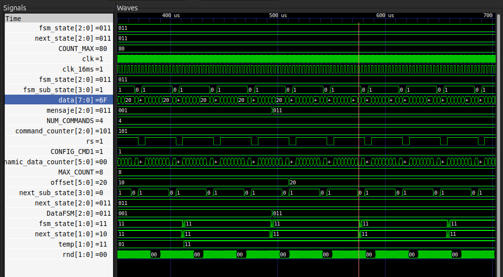
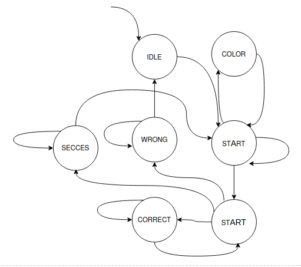
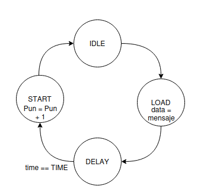
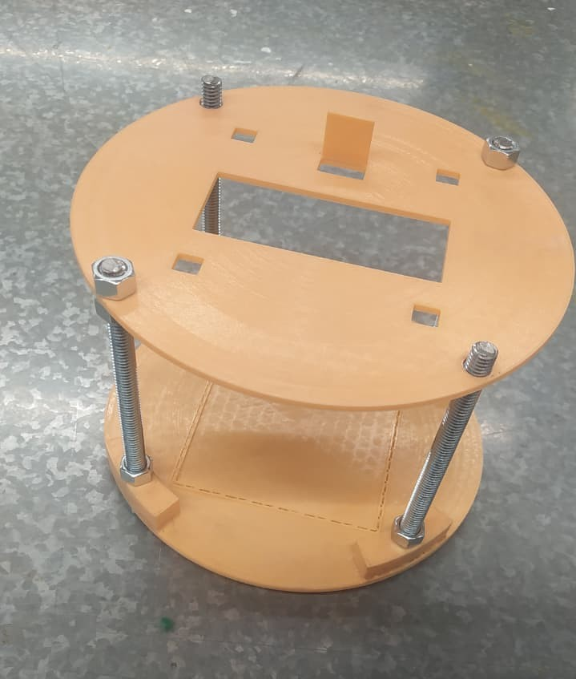

# Simon-Dice

## Integrantes

David Steven Pinzón Hernández

Gabriel Mauricio Estupiñan Parada

Laura Daniela Sarmiento Mendoza

Cristhian Steven Hendes Soraca

## Informe

Indice:

1. [Diseño implementado](#1-diseño-implementado)
2. [Simulaciones](#2-descripción)
3. [Implementación](#3-diagramas)
5. [Implementación](#4-implementación)
6. [Conclusiones](#conclusiones)

## 1. Nota aclaratoria

El proyecto, en un principio, tenía la estructura que se muestra a lo largo del informe; sin embargo, debido a varias dificultades, fue necesario condensar varias funcionalidades en un solo módulo, específicamente en el LCD_controller. Adicionalmente, no nos fue posible completar el protocolo I2C, aunque lo que se desarrolló más adelante fue el avance que logramos conseguir.

## 1. Diseño implementado

### - FSM

La idea original se desarrollo a partir del diagrama de flujo ue se mostró con anterioridad. Se definieron 7 estados. La idea general consiste en ue el modulo carga un patrón de colores aleatorios en una memoria, los muestra en pantalla mientras se esta cargando, para luego empezar a recibir los resultados del protocolo I2C y compara los con el patrón previamente cargado. Si el usuario colocase el patrón completamente vuelve a comenar cargando un nuevo patron, y va sumando al puntaje. Si el usuario comente algun error, inmediatamente se temina el juego y resetea el puntaje. Teoricamente deberia ir aumentando la cantidad de colores en cada patrón. Esta loguca se puede ver desarrollada en verilog en el archivo FSM.v. 

Sin embargo, la lógica principal del dispositivo se tuvo que cambiar debido a la dificultad de conectarlo con el sensor. Por lo que finalmente quedo mostrando un único color por vez. Este color sigue siendo pseudoaleatorio, y depende del reloj del dispositivo. Este color aleatorio se debe comparar con los resultados del sensor y si coincide añade $+$1 al puntaje. Esta lógica se redujo a 4 estados y se puede ver con mas detalle en el archivo FSM_V2.v.

### - LCD

El funcionamiento de la pantalla LCD reúne todas las componentes vistas en el componente teórico y practico de la materia, requerimos para su correcto funcionamiento la implementación en VHDL de un modulo con registros, contadores y lógica combinacional y secuencial para la ejecución de la maquina de estados.

El correcto comprendimiento de los puertos de la LCD es clave en la definición de salidas del modulo, puesto que esta cuenta con un selector de tipo de datos que permite distinguir entre datos de configuración y caracteres que representan la escritura (ambos datos de 8 bits en código hexadecimal), también cuenta con un selector de escritura y lectura que permitirá enviar y recibir datos de la pantalla, un puerto de alimentación y los puertos de envió de datos de salida de información los cuales llevan la información del respectivo texto a mostrar en pantalla.

Se definen dos grupos de estados, uno que representa los comandos de configuración de la pantalla y otro que representa los momentos en los cuales inicia la pantalla, carga datos de configuración y envía datos de escritura, se recalca que este ultimo se dividió en dos, uno para el texto estático que se muestra en la pantalla y otro que muestra el texto dinámico de la pantalla en respuesta a distintos valores de entrada (color a mostrar).

Los registros fueron utilizados para crear la memoria de datos estáticos y dinámicos y la memoria de comandos, estas memorias se recorren en la lógica secuencial de la respuesta y función de cada uno de los estados, utilizando contadores para recorrer cada posición de estos registros. La lógica combinacional se uso para la implementación de la transición de estados.

Los datos en memoria fueron almacenados por medio de la lectura de datos en formato hexadecimal que se encuentran registrados en archivos de formato txt, datos que representan el mensaje que se desea mostrar, para nuestro caso en un archivo .txt se guardaron el mensaje que se mostraría como texto estático el cual es "Simón dice" y en otro archivo se guardo el conjunto de mensajes que representara el texto dinámico dependiendo del valor de una entrada recibida del modulo FSM y que tiene como posibles mensajes los colores "rojo, verde, azul, amarillo y espacios en blanco".

### - I2C

Para la conexión con el modulo de color TCS34725, se implemento primero en un Arduino Uno, buscando conocer el proceso que realizaba la libreria de conexión para realizar la comunicación entre el microprocesador y el sensor, de manera que a partir de un analizador lógico realizamos una conexión a las puertos del Arduino que enviaban o recibían información del sensor, de manera que contrastando con el Datasheet del TCS34725, intentamos replicar este comportamiento en la FPGA.

A partir de los comandos que se pueden ver en la imagen, dígase de comandoss aquellos números como el 94, 96, 98 o 9A, que representan un envio de una orden al sensor, siguiendo la misma estructura de 5 bytes enviados y recibidos como se puede ver en la la imagen \ref{fig:PVampliada}, el primer byte de información dice la dirección del sensor a la cual se va a escribir la orden, en el siguiente byte se envía el la orden, luego el siguiente byte dice la dirección del sensor pero a diferencia del primero ahora esperamos comenzar a recibir datos del sensor y los siguientes dos bytes traerán la información del color recibido, también podemos ver que existen unos bits intermedios los cuales son la confirmación del sensor de que la información fue recibida y entendida.

## 2. Simulaciones (Descripción)

### - FSM

### - LCD
### - I2C

## 3. Diagramas

### - FSM

### - LCD
### - I2C

## 4. Implementación

## Conclusiones

- 